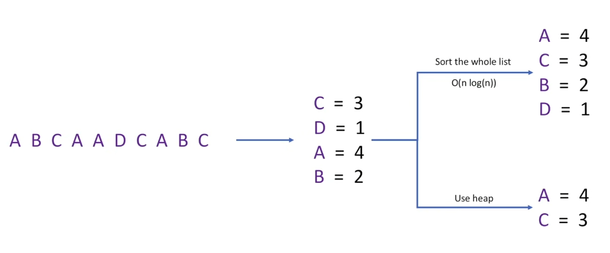
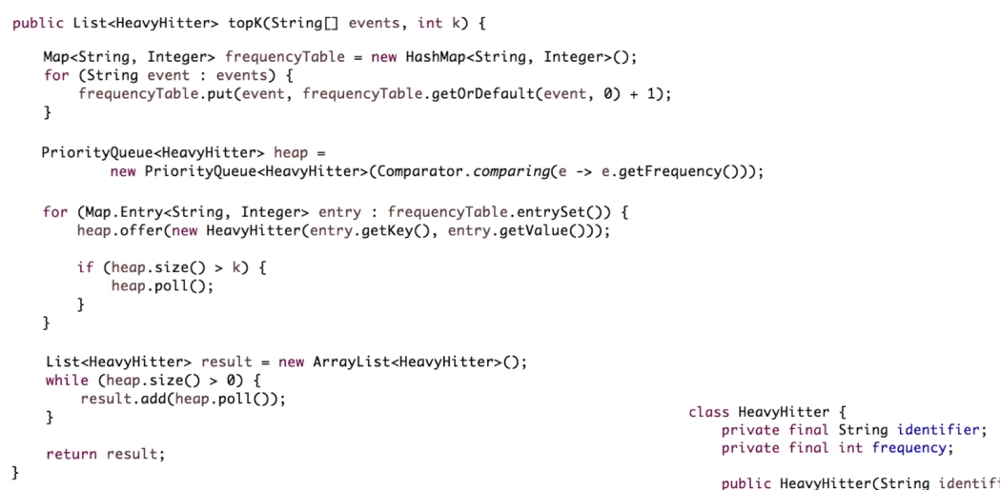
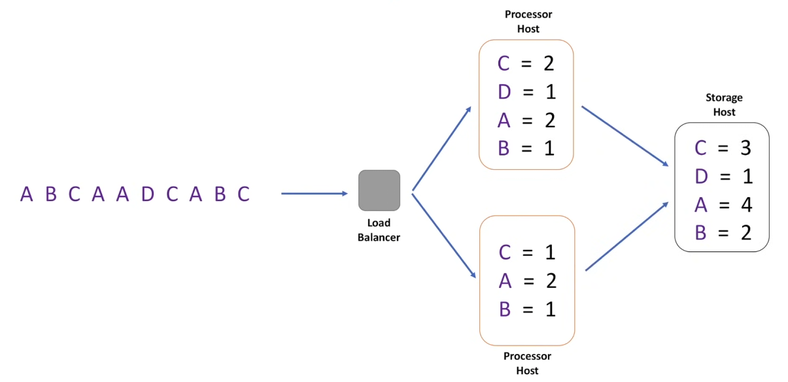
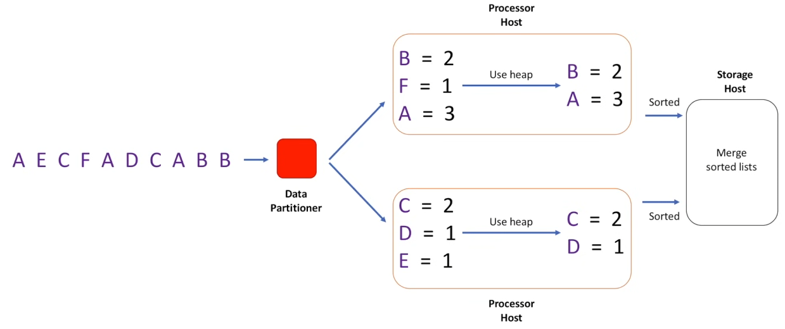
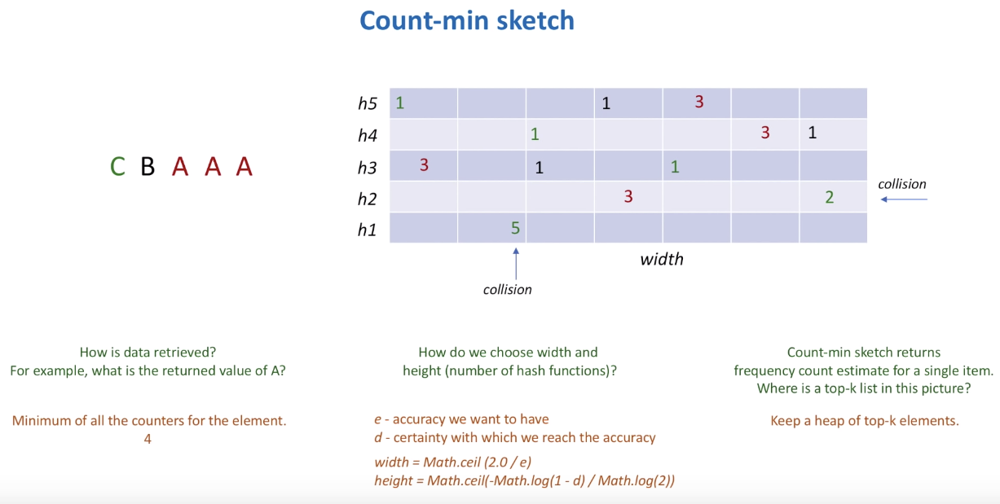
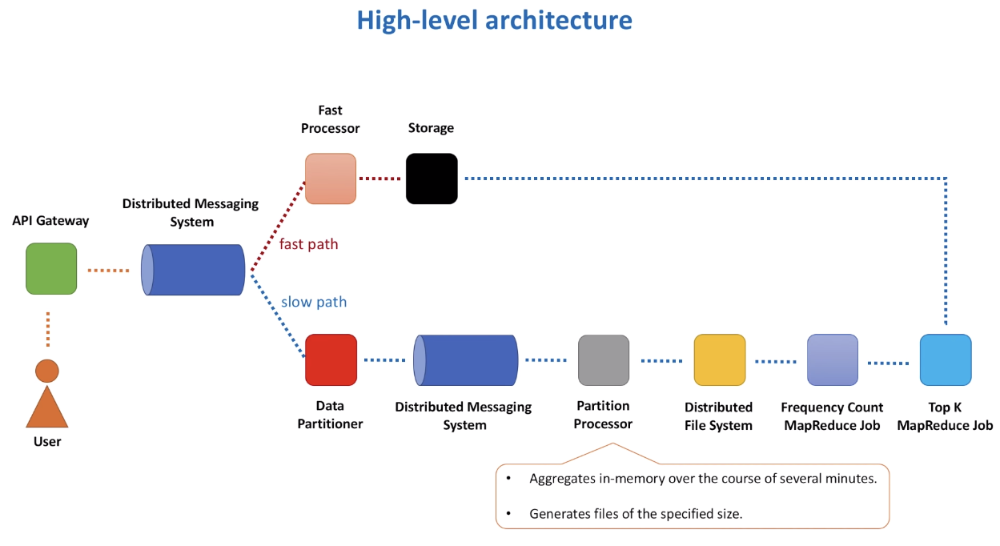
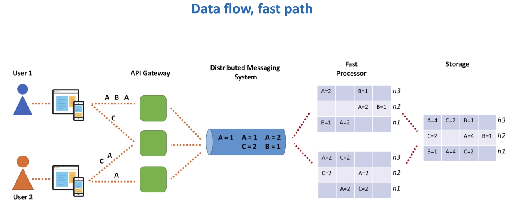
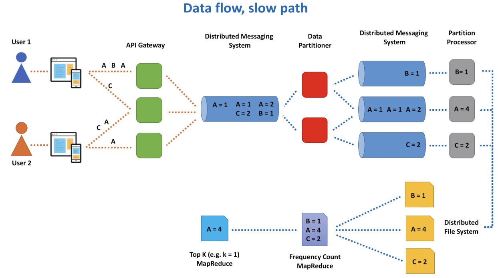
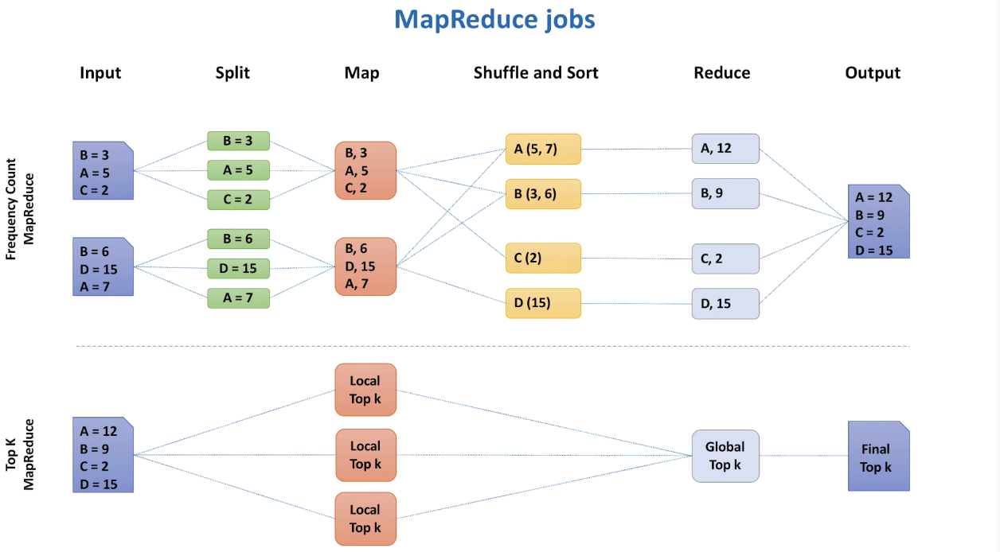
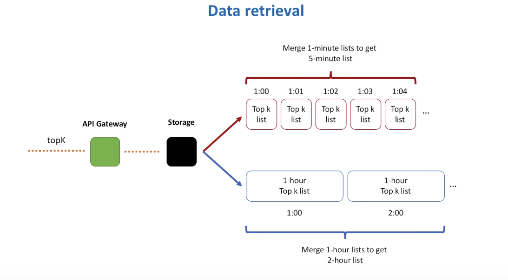

## 概述

Top k 问题解决方案的各种应用（Google/Twitter/YouTube 趋势、热门产品、波动性股票、DDoS 攻击预防）。

在这样的规模下，数据库或分布式缓存不是一个选项。我们可能正在处理 1M RPS。如果我们使用 DB 来跟踪视图计数，首先写入/更新会非常慢，然后找到前 K 项需要扫描整个数据集。

也许 **MapReduce** 可以提供帮助。但这还不够。我们需要尽可能接近实时地返回重磅统计数据。

例如：

- Calculate top 100 list for last
- 1 min, 5 min, 15 mins, 60 mins etc.

**这使得这个问题成为流处理问题**

## 前置知识

MapReduce

Count-min sketch

数据聚合原理

合并 N 个排序列表问题

## 需求

**功能**

- topK(k,startTime,endTime)

**非功能**

- 高扩展（随着数据量的增加而扩展：视频、推文、帖子等）
- 高可用性（在硬件/网络故障中幸存，没有 SPOF）
- 高性能（返回前 100 名列表需要几十毫秒，考虑到性能要求，这暗示了最终列表应该预先计算，我们应该避免在调用 top K API 时进行繁重的计算。）
- 准确性（例如，通过使用数据采样，我们可能不会计算每个元素，而只计算一小部分事件）

## 渐进设计

### 哈希表+单主机

- 在 hashmap 中保留传入事件列表的计数

- - 按频率对 hashmap 中的条目列表进行排序，并返回前 K 个元素。时间 `O(nLogN)`
  - 将元素放在大小为 K 的堆上。时间复杂度`O(nLogK)`

### 哈希表+多主机

- 如果您将所有 youtube 视频 ID 存储在您作为主机的内存中，内存将是一个问题

**虽然增加了吞吐量，但是有内存瓶颈，hash 表会越来越大**

### 哈希表+多主机+分区

- 我们不会将所有哈希表数据从所有主机发送到存储主机。相反，我们会在每个主机上单独计算 topK 列表，最后我们需要在存储主机上合并这些排序的列表。

数据分区可以不将所有数据存储到一个主机上，减少了每个主机内存的压力

### 总结

**问题**

- 我们认为数据集是无界的，这就是为什么我们能够考虑将其划分为多个块。**但流数据没有界限**。它不断涌现。在这种情况下，处理器主机只能在一段时间内继续积累数据，在此之前**它将耗尽内存**。比如 1 分钟。

- - 我们将 1 min 数据刷新到存储主机
  - 存储主机存储每分钟的热点列表
  - 我们故意丢失了有关非 topK 元素的所有信息。我们负担不起在内存中存储每个视频的信息。
  - 但是，如果我们想找到过去 1 小时或过去 1 天的 topK，我们如何使用 60 个 1 分钟 list 来构建它呢。鉴于当前的方法，没有解决此问题的正确方法。要找到当天的 topK，我们需要全天的完整数据集。
  - 需求冲突，保留完整的 1 天数据（以满足需求）或丢失它以负担存储。让我们把所有数据存储在磁盘上，因为它无法放入内存，并使用批处理框架来做 topK 列表。Map Reduce 架构将发挥作用

- 每次引入数据分区时，我们都必须考虑数据复制，以便将每个分区的副本存储在多个节点上。我们需要考虑在集群中添加/删除新节点时重新平衡。我们需要处理热分区。

**解决方案**

在进入上面讨论的方法之前，让我们想一想是否有一个简单的解决方案来解决 topK 问题？

权衡利弊权衡利弊，所有的选择，不过是权衡利弊罢了

我们需要在此过程中做出牺牲。准确性就是牺牲

我们要合理利用数据结构，这将帮助我们使用固定大小的内存计算 topK，但结果可能不是 100% 准确

**Count-Min Sketch！**

## 高层架构

- **API Gateway**：连接到视频内容交付系统，该系统将提供视频请求

- - 对于我们的用例，我们对 API 网关的 1 个功能感兴趣，即日志生成，其中记录对 API 的每次调用。通常这些日志用于监控、日志记录和审计。我们将使用这些日志来计算每个视频的观看次数。我们可能有一个后台进程，它从日志中读取数据，进行一些初始聚合并发送数据进行进一步处理。
  - 为 API 网关服务上的缓冲区分配内存，读取日志行，并构建频率计数哈希表。此缓冲区的大小应有限，当缓冲区已满时，将刷新数据。如果缓冲区在某个时间段内未满，我们可以根据时间段进行 flush。
  - 其他选项可以是动态聚合数据，而不写入日志文件。或者完全跳过 API 网关端的数据聚合，并将有关每个事件（正在查看的视频）的信息进一步发送以进行处理。评估每个选项的优缺点。
  - 我们可以通过以紧凑的二进制格式（例如 Apache Avro）序列化数据来节省网络 IO 利用率，并让 CPU 付出代价。所有这些注意事项都取决于 API 网关主机上可用的资源，即内存、CPU、网络和磁盘 IO。

- **distributed messaging system**：初始聚合数据将发送到分布式消息传递系统，如 Apache Kafka。
- **Fast path and Slow path**

- - 在 Fast path 中，我们将大致计算 topK hitter 的结果。结果将在几秒钟内提供。
  - 在 slow path 中，我们将精确计算 topK hitter 的结果。几分钟/几小时内即可获得结果。
  - 根据系统对系统时序的限制（是否需要近实时结果，或者延迟是否可以接受以实现精度），您应该选择**任一路径**。

## 客户端检索数据

**合并 2 个不同的结果集来回答 API 调用并不准确，但这是一种权衡。您无法在任何时间聚合数据。您必须了解确切需要的东西，并据此进行构建。**

## 解答疑惑

- **我们是否可以使用哈希映射，但每隔几秒钟将其内容（转换为堆后）刷新到存储中，而不是使用 CMS？**

- - 对于小规模，使用哈希映射是完全可以的。当规模增长时，哈希映射可能会变得太大（使用大量内存）。为了防止这种情况，我们可以对数据进行分区，以便只有所有数据的子集进入 Fast Processor 服务主机。但它使架构复杂化。CMS 的美妙之处在于它消耗有限的（定义的）内存，并且无需对数据进行分区。CMS 的缺点是它大约计算数字。权衡，权衡......

- **我们如何将 count-min sketch 和 heap 存储到数据库中？如何设计 table 架构？**

- - Heap 只是一个一维数组。CMS 是一个二维数组。这意味着两者都可以很容易地序列化为字节数组。使用语言原生序列化 API 或备受推崇的序列化框架（Protobufs、Thrift、Avro）。我们可以将它们以这种形式存储在数据库中。

- **虽然 CMS 是为了节省内存，但我们还有 n log k 时间来获得前 k，对吧？**

- - 是的。它是 `O(nlogk)`（用于堆）+ `O(klogk)`（用于对最终列表进行排序）。N 通常比 k 大得多。所以，`O(nlogk)` 是主导的。

- **如果 CMS 只用于 1 min 计数，为什么我们不直接使用哈希表来计数呢？毕竟，数据集的大小不会无限增长。**

- - 对于中小规模，哈希表解决方案可能效果很好。但请记住，如果我们尝试创建一个需要为许多不同场景查找前 K 个列表的服务，则可能会有**很多**这样的哈希表，并且它不会很好地扩展。例如，最常喜欢/不喜欢的视频、观看次数最多（基于时间）的视频、评论次数最多的视频、视频打开期间异常数量最多的前 K 名等。类似的统计数据可以按渠道级别、每个国家/地区等进行计算。长话短说，我们可能需要使用我们的服务来计算许多不同的前 K 名列表

- **如何合并两个 1 小时的 top k 列表，以获得 2 小时的 top k？**

- - 我们需要对相同标识符的值求和。换句话说，我们会汇总两个列表中相同视频的观看次数。并获取合并列表的前 K （通过排序或使用 Heap）。 [不过，这不一定是 100% 准确的结果]

- **当存在您提到的不同情况时，CMS 如何工作......最赞/最不喜欢的视频。我们需要构建多个 CMS 吗？我们是否需要为每个类别指定哈希值？无论哪种方式，它们都需要更多的内存，就像哈希表一样。**

- - 正确。我们需要特定的 CMS 来计算不同的事件类型：视频观看次数、喜欢、不喜欢、提交评论等。

- **关于慢路径，我对数据分区器感到困惑。我们是否可以删除第一个 Distribute Messaging System 和 data partitioner？API 网关将根据其分区直接向第二个 Distribute Messaging System 发送消息。例如，API 网关会将所有 B 消息发送到分区 1，将所有 A 消息发送到分区 2，将所有 C 消息发送到分区 3。为什么我们需要第一个 Distribute Messaging System 和 data partitioner？如果我们使用 Kalfa 作为 Distribute Messaging System，我们可以只为一组消息类型创建一个主题。**

- - 在大规模（例如 YouTube 规模）的情况下，API Gateway 集群将处理大量请求。我假设这些是数千甚至数万台 CPU 密集型计算机。主要目标是提供视频内容并尽可能少地做 “其他” 事情。在这样的机器上，我们通常希望避免任何繁重的聚合或逻辑。我们能做的最简单的事情是将每个视频观看请求批处理在一起。我的意思是根本不做任何聚合。创建包含如下内容的单个消息：{A = 1， B = 1， C = 1}，并将其发送以进行进一步处理。在您提到的选项中，我们仍然需要在 API Gateway 端进行聚合。由于规模很大，我们无法承受每个视频观看请求向第二个 DMS 发送一条消息的后果。我的意思是我们不能有三条消息，比如：{A = 1}、{B = 1}、{C = 1}。如视频中所述，我们希望在每个下一个阶段降低请求率。

- **我有一个关于快速路径的问题，似乎您将聚合后的 CMS 存储在存储系统中，但这足以计算前 k 个吗？我觉得我们需要有一个网站列表，并在某个地方维护一个大小为 k 的堆，以找出前 k 个。**

- - 你是对的。我们始终保留两种数据结构：一个 count-min sketch 和一个 Fast Processor 中的堆。我们使用 count-min sketch 进行计数，而 heap 存储前 k 个列表。在 Storage 服务中，我们也可以同时保留两者或仅保留堆。但是 heap 始终存在。

- **所以总的来说，我们仍然需要存储 keys。。。Count-min Sketch 无需单独维护 Key 的计数，从而有助于节省成本...当必须找到前 k 个元素时，必须遍历每个键并使用 count-min sketch 来找到前 k 个元素......这种理解准确吗？**

- - 我们需要存储 keys ，但只需要存储其中的 K（或更多）。并非全部。
  - 当每个 key 到来时，我们执行以下操作：

- - - 将其添加到 count-min 草图中。
    - 从 count-min 草图中获取密钥计数。
    - 检查当前 key 是否在堆中。如果它出现在堆中，我们在那里更新它的 count 值。如果它不存在于堆中，我们检查堆是否已满。如果未满，我们将此键添加到堆中。如果 heap 已满，则检查最小 heap 元素并将其值与当前 key count 值进行比较。此时，我们可以删除最小元素并添加当前键（如果当前键计数 > 最小元素值）。

- - 这样我们只保留预定义数量的 key。这保证了我们永远不会超过内存，因为 count-min sketch 和堆的大小都是有限的

## 参考资料

https://www.youtube.com/watch?v=kx-XDoPjoHw
